# Udagram Microservices
---
Antonette Caldwell Udacity Cloud Developer Nanogree program

The url to the project: https://github.com/pullmana8/Project-3-Udagram-Microservice

# Getting Started
---

# Purpose
---
To design, deploy and operate a cloud native photo sharing application

# Prerequisites
---
You will need to have the following packages installed:
* Docker
* AWS CLI
* Eksctl
* Kubectl

# Setup Environment Variables
---

# Setup Docker Environment
---
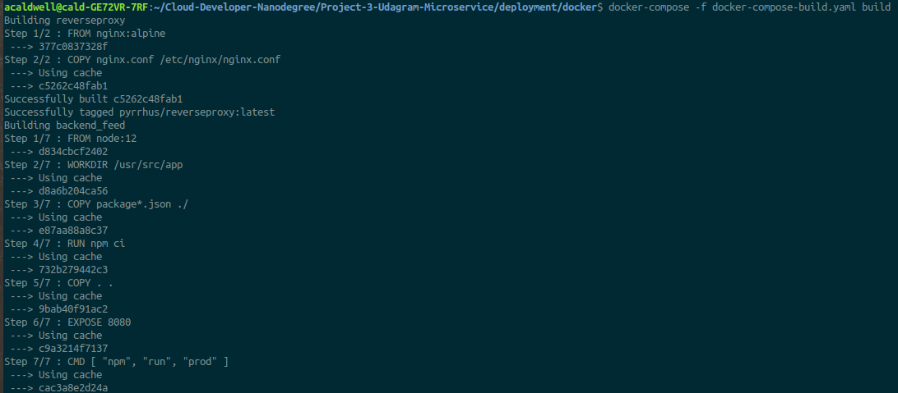

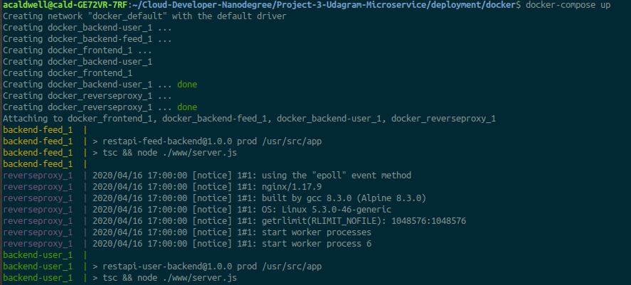

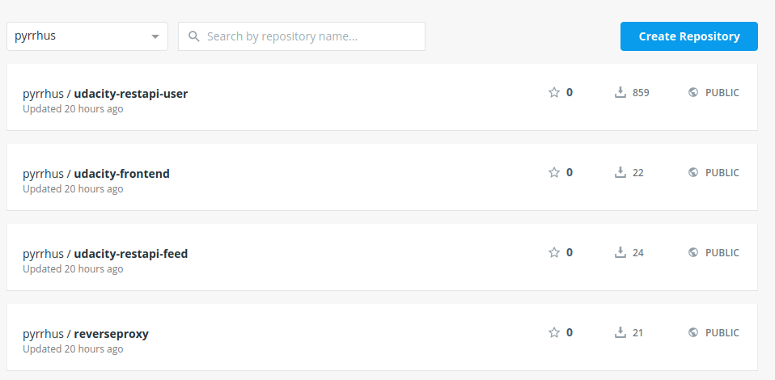

# Create a Kubernetes Cluster on Amazon EKS with eksctl
```
eksctl create cluster \ 
--name "ClusterName" \
--version 1.14 \
--nodegroup-name standard-workers \
--node-type t3.medium \
--nodes 3 \
--nodes-min 1 \
--nodes-max 4 \
--node-ami auto
```

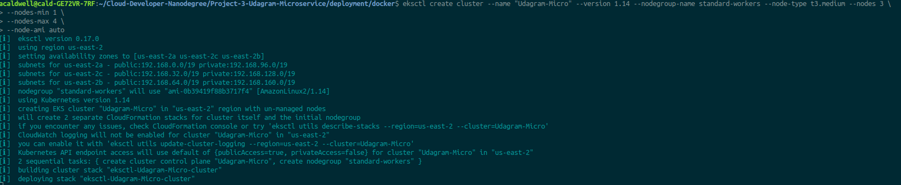

# Create Kubernets Components (Configmaps and Secrets)
Encrypt database user and password
```
echo $POSTGRES_USERNAME | base64 &&  echo $POSTGRES_PASSWORD | base64
```

Encrypt aws files using base64
```
cat ~/.aws/credentials | base64
```

Add the values to env-secret.yaml, aws-secret.yaml, and env-config.yaml

# Setup local Kubernetes environment
Load secret files first
```
kubectl apply -f aws-secret.yaml
kubectl apply -f env-secret.yaml
kubectl apply -f env-configmap.yaml
```
Apply the service next
```
kubectl apply -f reverseproxy-service.yaml
kubectl apply -f backend-user-service.yaml
kubectl apply -f backend-feed-service.yaml
kubectl apply -f frontend-service.yaml
```
Apply the remaining files
```
kubectl apply -f .
```

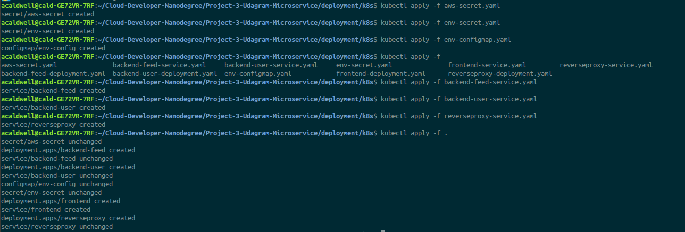

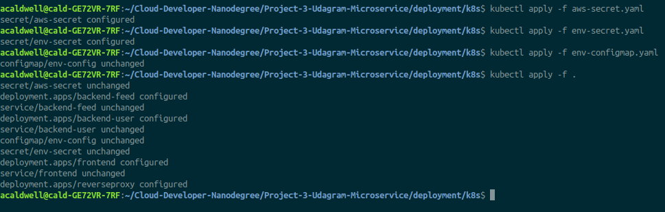

# Check Pod status
```
kubectl get all
```

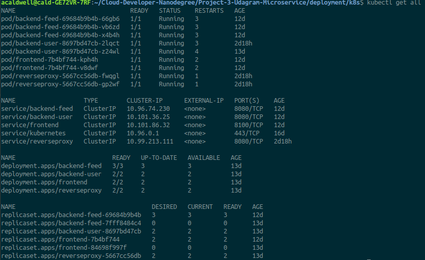

# Connect the services with port forwarding
```
kubectl port-forward service/frontend 8100:8100
kubectl port-forward service/reverseproxy 8080:8080
```

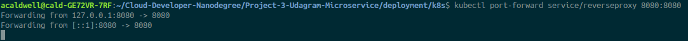

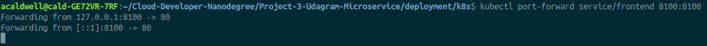

# Successfull deployment to Amazon Kubernetes Cluster service
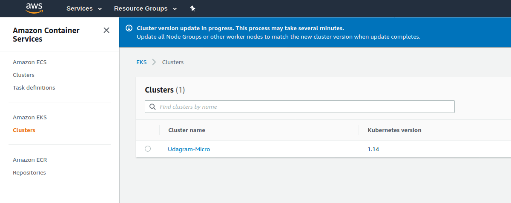

# CI/CD with TravisCL
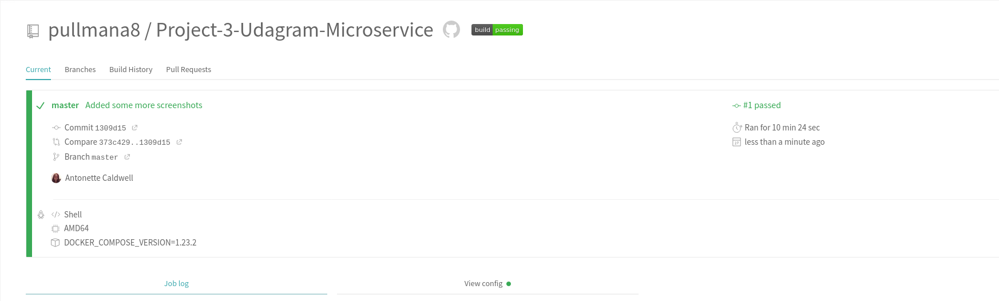